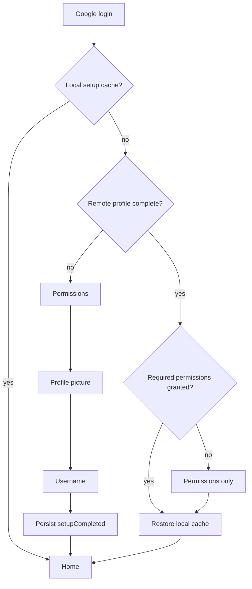
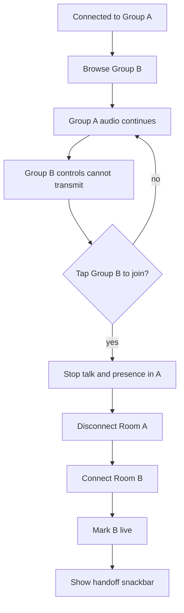

# Voice, Onboarding, and Service Reliability Engineering Report

Date: 2026-07-26

## 1. Implementation Summary

### Persistent authentication and onboarding

- Added `setupCompleted` to the persisted Firebase Realtime Database user
  profile. Realtime Database is the profile store in this codebase; Firestore
  is not used.
- Kept the per-install `SharedPreferences` value only as a fast cache.
- Added migration for existing users: a persisted name plus profile photo is
  treated as completed setup and backfilled with `setupCompleted: true`.
- Restored the intended first-use order: login, permissions, profile picture,
  username, home.
- Returning users skip profile picture and username. After reinstall, only
  permissions that were removed with the install are requested before home.
- Bounded the remote profile lookup to three seconds. Failure produces the
  existing retryable startup error instead of incorrectly treating the account
  as new.

### Picture-in-picture

- Reduced the Android PiP actions from two to one microphone toggle.
- Reduced the Flutter PiP status UI from two microphone icons to one clear
  green-on/slashed-off indicator.
- Kept active-speaker profile switching through LiveKit active-speaker events.
- Replaced the vertically rigid PiP `Column` with a clipped `Stack` sized from
  live constraints.
- Kept the compact view during Android's intermediate PiP-exit frames when the
  window height is below 480 logical pixels, preventing the full home layout
  from rendering into PiP-sized constraints.
- Added short state animations and retained semantic speaking/microphone
  labels.

### Nudge and action hierarchy

- Replaced the oversized text-heavy Raise Hand control with the same 48×48
  circular control used by Nudge and Keyboard.
- Standardized icons, spacing, animation, tooltips, enabled states, and
  minimum touch targets.
- Chose the ergonomic layout `Nudge | Raise Hand | Keyboard` directly below
  the group header. It keeps the primary voice-area center aligned while all
  secondary actions remain one tap away.
- Nudge remains visible only when at least one active peer is offline.
- Keyboard stays aligned and visible, but disabled until an in-call reaction
  can be sent.

### Group browsing and voice-session ownership

- Separated the viewed group (`_selectedGroup`) from the connected group
  (`_onlineSession.groupId`).
- Swiping or selecting another group no longer disconnects the active room.
- Talk, hand raise, and reaction controls are disabled while viewing a group
  other than the connected group.
- The connected group has a green outer ring even while another group is
  focused.
- Tapping the focused disconnected group performs an intentional handoff:
  disconnect old room, connect new room, then show the requested snackbar.
- The single `_room` field and connect-time cleanup preserve the invariant of
  one local LiveKit connection.

### Service availability framework

- Added Firebase Remote Config using the existing Firebase app.
- Added reusable maintenance, country restriction, offline, slow-network, and
  backend-failure screens.
- Added Remote Config parameters for status, optional guidance, and the Reddit
  updates URL.
- Offline connectivity overrides remote state. Slow-network guidance is
  dismissible and keeps the active child mounted; blocking states replace it.
- Config fetch uses a five-second timeout and 15-minute minimum interval and
  refreshes when the app resumes.
- Failed fetches use cached/default values. Unknown future status strings fail
  open to `operational`.
- Country rollouts are supported through Firebase Remote Config conditions:
  the server condition returns `country_restricted` only to targeted countries.

### Network loss and presence

- Connectivity loss and unexpected LiveKit room disconnects now route through
  one cleanup path.
- Local room, talk state, heartbeat, inactivity timer, usage timer, PiP state,
  and UI presence are cleared immediately.
- Firebase `onDisconnect` is registered once when the session starts for the
  availability, app-service-session, and LiveKit-session records.
- The disconnect records explicitly contain `network_loss`, stopped service
  state, disconnected LiveKit state, and Away presence.
- Peers receive `<username> lost connection.` from either the presence
  transition or LiveKit participant-disconnect event, with three-second
  duplicate suppression.
- Recovery is intentionally explicit: a full connectivity loss marks the user
  Away; after reconnection they tap to join again. Brief LiveKit transport
  interruptions that do not become `ConnectivityResult.none` retain the SDK's
  normal reconnect path.

## 2. Root Cause Analysis

| Issue | Root cause and failing condition | User impact | Resolution and prevention |
|---|---|---|---|
| Onboarding after reinstall | Startup tested only `SharedPreferences`. Uninstall deleted `one_one_setup_complete_<uid>`, while the remote profile refresh ran later and was not consulted by routing. | Returning users repeated profile and username setup. | Remote `setupCompleted` is authoritative; local state is only a cache. Legacy-profile migration and focused tests cover both explicit and inferred completion. |
| PiP taps and overflow | Android exposed both toggle and mute actions, while Flutter also drew two mic states. On PiP exit, Android reported mode exit before full-size constraints arrived, so the fixed full-screen `Column` briefly rendered in a small window. | Extra choices, small controls, and transient render overflow. | One native toggle, one status indicator, constraint-driven clipped PiP layout, and compact rendering during intermediate window sizes. |
| Nudge hierarchy | Raise Hand used a double-width text pill while Nudge and Keyboard were small side icons; invisible controls preserved uneven space without communicating availability. | Poor scan order, inconsistent alignment, excess vertical/central weight. | Three consistent 48×48 controls with tooltips and semantic states; Nudge visibility derives from the tested `groupNeedsNudge` condition. |
| Disconnect while browsing | `_selectedGroup` served as both navigation focus and voice-session owner, and `_onGroupCarouselChanged` called `_goAway()` before every selection. | Every swipe tore down audio and presence. | Session ownership now comes from `OnlineSession.groupId`; selection changes subscriptions and screen data only. Explicit join performs the only handoff. |
| Missing service status handling | There was a Remote Config template but no client dependency, gate, status model, or connectivity override. Failures surfaced as unrelated screen-specific errors. | No consistent maintenance, regional, offline, degraded, or backend UX. | One root gate, typed states, safe defaults, Remote Config conditions, resume refresh, and exact status-screen tests. |
| Stale presence after loss | Connectivity events only updated an icon. `RoomDisconnectedEvent` did not clear `_onlineSession`, so heartbeats could continue. `onDisconnect` covered only availability and was re-registered on every heartbeat. | The local user and peers could see stale online state; service/session records remained running. | Shared cleanup clears local state, and one-time multi-record `onDisconnect` updates presence plus both session records. Peer notifications use both LiveKit and Firebase signals. |

Regression prevention is provided by the existing presence/Nudge tests plus new
tests for remote onboarding completion, legacy migration, supported PiP
actions, safe status parsing, and every required status screen. Static analysis
and Android compilation run cleanly.

## 3. Performance Analysis

No physical-device profiler or production LiveKit endpoint was available in
this workspace. The table separates verified structural changes from metrics
that still require device telemetry; it does not invent timings or memory
figures.

| Metric | Before | After | Evidence |
|---|---|---|---|
| Warm startup, same install | Local setup lookup | Same local lookup | No new remote read when the per-user cache is present. |
| Returning startup after reinstall | Incorrectly routed to onboarding without a remote setup read | One point read of `/users/<uid>`, bounded to 3 s | Code-path count; real network latency is environment-dependent. |
| Voice connection latency | Token request + LiveKit connect + presence write | Unchanged for a normal join | No new operation was added to the media connect path. |
| Group browse responsiveness | One disconnect/presence teardown per group change | Zero voice connection events per browse | `_onGroupCarouselChanged` no longer calls `_goAway`. |
| Intentional group handoff | Not supported as a distinct action | Exactly one old-room disconnect followed by one new-room connect | Sequential handoff preserves the one-room invariant. |
| Reconnection time | LiveKit SDK reconnect, but terminal disconnect could leave stale app state | SDK reconnect remains for transient transport loss; full network loss becomes Away immediately | Exact milliseconds require network shaping on a device. |
| PiP interaction choices | Two native actions and two Flutter mic indicators | One native action and one Flutter mic indicator | 50% fewer native action choices; Android may still require revealing system PiP controls. |
| Presence registration traffic | Availability `onDisconnect` registered at mark-live and every 10 s heartbeat | Three record registrations once per session, zero steady-state re-registration | Removes approximately six repeat availability registrations per online minute. |
| UI responsiveness | Full layout could render during a PiP-sized transition frame | Compact layout remains below 480 px height; group browsing performs no teardown I/O | Runtime frame timing still requires DevTools profile mode. |
| Memory usage | One LiveKit `Room`; listeners/timers disposed | Still one `Room`; status adds one Remote Config singleton and one connectivity subscription | No quantitative MB comparison was collected; no additional media graph or room is retained. |

Validation results:

- `flutter analyze`: zero issues.
- `flutter test`: 25 tests passed.
- Android `assembleDebug`: passed.
- Android `compileDebugKotlin`: passed.

The default machine JDK is 26.0.1, which the repository's Gradle Kotlin parser
cannot parse. Android validation therefore used the installed JDK 17.0.16.

## 4. Risk Assessment

| Risk | Severity | Current mitigation / limitation |
|---|---|---|
| Android controls when app is already in PiP | Medium | Android owns the PiP chrome; many versions require one tap to reveal the single RemoteAction. Direct always-visible app touch handling is not available in standard PiP. iOS PiP is not implemented by the existing Android-only bridge. |
| Hard force-stop and killed-process restoration | High | Android force-stop cannot be bypassed. The app does not restore an active LiveKit room after process death; Firebase `onDisconnect` marks it away instead. |
| Multi-device account concurrency | High | One app process owns one room, but a second device using the same account can still request another token. Presence records identify an active device, but the backend does not yet reject/evict the older device. |
| Audio interruptions and device routing | Medium | LiveKit/WebRTC provides native audio focus and route handling, and the app reapplies the stored speaker/earpiece choice. Explicit UX and automated coverage for calls, alarms, and Bluetooth handoff are still absent. |
| Remote Config operations | Medium | Defaults fail open. Production still must publish country conditions, maintenance guidance, and the actual Reddit URL; the client cannot infer policy without those values. |

## 5. Future Recommendations

| Priority | Effort | Recommendation |
|---|---|---|
| High | Medium | Add Android device tests with network shaping for Wi-Fi loss, handoff, LiveKit reconnect, PiP enter/exit, calls, alarms, and Bluetooth changes. |
| High | Large | Add backend-enforced session leases keyed by user/device to arbitrate multi-device use and make process-death restoration or eviction explicit. |
| High | Medium | Record startup, token, connect, reconnect, frame-time, memory, and presence-propagation histograms so future reports contain physical-device p50/p95 values. |
| Medium | Medium | Add explicit audio-interruption state and recovery UI on top of LiveKit/WebRTC callbacks, including route-change confirmation. |
| Medium | Small | Publish production Remote Config conditions and the Reddit URL, then run a staged maintenance/country-restriction drill before release. |
