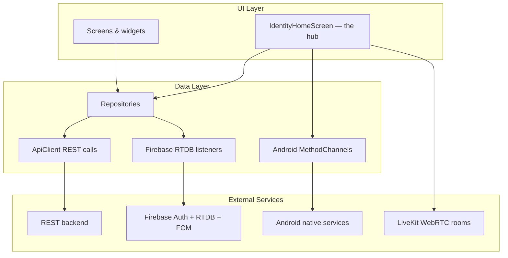
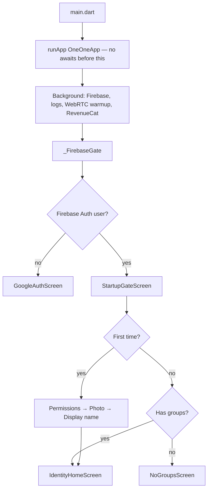
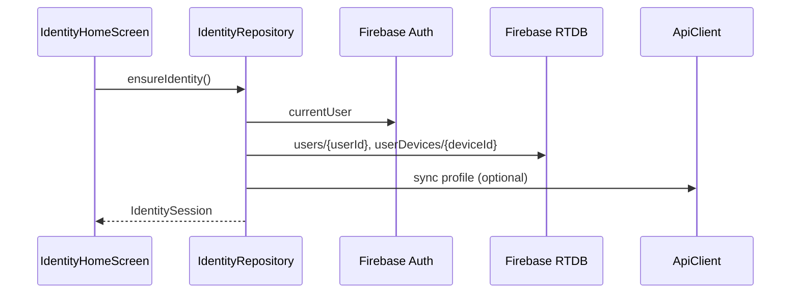
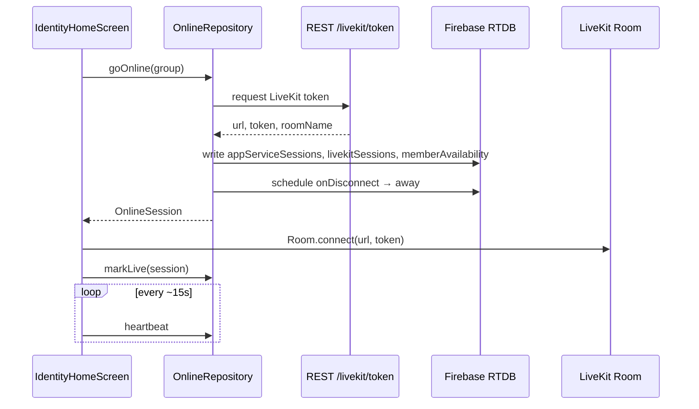
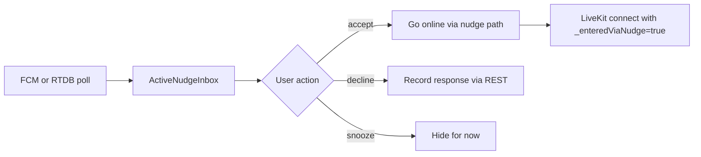

# Duo Flutter App — Architecture Guide

> A plain-language map of how the Flutter client is organized, how the core features work, and what to improve before going live.

**Last updated:** August 2026  
**Scope:** Flutter app only (`app/`). Backend is out of scope here.

---

## What this app is

**Duo** is an Android-first walkie-talkie app for small private friend groups. The core loop:

1. Sign in with Google
2. Join or create a group
3. Go **online** → connect to a LiveKit voice room
4. Hold the mic to **talk** (one speaker at a time)
5. **Nudge** offline friends to join
6. Send short **chat bubbles** while coordinating

Real-time presence and coordination live in **Firebase Realtime Database (RTDB)**. Authenticated actions (tokens, group creation, push nudges) go through a **REST API**. Live audio runs through **LiveKit**.

---


## Repo layout (Flutter only)

```text
app/
├── lib/
│   ├── main.dart                 # Entry point — paints UI immediately, defers heavy init
│   ├── app/                      # Shell: auth gate, onboarding, theme, startup routing
│   ├── core/                     # Shared infra: Firebase, API client, logging, storage
│   ├── features/                 # Product features (data / models / ui)
│   │   ├── identity/             # Auth, profile, settings, HOME SCREEN
│   │   ├── groups/               # Groups, invites, membership
│   │   ├── online/               # LiveKit, presence, PiP, reconnect
│   │   ├── nudges/               # Push / ring / voice nudges
│   │   ├── chat/                 # Ephemeral group bubbles
│   │   ├── talk/                 # Push-to-talk floor control
│   │   ├── subscriptions/        # RevenueCat / Eleven Pro
│   │   └── service_status/       # Remote Config + connectivity gate
│   └── phase1_spike/             # Old prototype — NOT wired into production
├── android/                      # Native Android (FCM nudges, invite links, foreground service)
└── test/                         # Unit tests (34 files); mirrors lib/ structure
```

**112 Dart files** in `lib/`. **34 test files** in `test/`.

---


## Mental model: three layers




| Layer        | Responsibility                    | Key idea                                                |
| ------------ | --------------------------------- | ------------------------------------------------------- |
| **UI**       | Screens, gestures, animations     | Mostly `StatefulWidget` — no Riverpod/Bloc              |
| **Data**     | Repositories talk to RTDB + REST  | Thin wrappers, optional constructor injection for tests |
| **External** | Firebase, LiveKit, native Android | Hybrid: RTDB for live state, REST for secure mutations  |


---


## How the app starts

Startup is optimized so the **first Flutter frame paints before any I/O**.




### Key files


| File                                        | Role                                                              |
| ------------------------------------------- | ----------------------------------------------------------------- |
| `lib/main.dart`                             | Error handlers, `runApp`, deferred bootstrap                      |
| `lib/app/one_one_app.dart`                  | `MaterialApp`, auth gate, global navigator key, PiP overlay shell |
| `lib/app/startup_gate_screen.dart`          | Post-login routing, invite-link handling, prefetch                |
| `lib/core/firebase/firebase_bootstrap.dart` | One-time Firebase init (shared future with gate)                  |


### Startup tricks worth knowing

- **No state-management package** — local `StatefulWidget` state + a few `ValueNotifier` / `ChangeNotifier` singletons.
- **Native splash bridge** — Android keeps a native splash until Flutter calls `NativeSplashBridge.markReady()`.
- **Parallel prefetch** — groups and member lists load while onboarding screens show.
- **Local-first identity** — cached session shows home fast; RTDB refresh happens in background.

---


## Feature modules

Each feature follows the same folder pattern:

```text
features/<name>/
  data/     → repositories, bridges, stores
  models/   → plain Dart classes
  ui/       → screens and widgets
```

There is **no shared domain layer** and **no dependency injection container**. Screens typically do `GroupRepository()` inline.

---


## Core feature #1: Identity

**Purpose:** Who you are, your device, settings, and the app shell.


| Piece          | File                                                       | What it does                                                              |
| -------------- | ---------------------------------------------------------- | ------------------------------------------------------------------------- |
| Repository     | `identity/data/identity_repository.dart` (~930 lines)      | Google sign-in, profile CRUD, device registration, FCM token, setup flags |
| Session model  | `identity/models/identity_session.dart`                    | userId, deviceId, displayName, photo, settings                            |
| Home bootstrap | `identity/data/identity_home_bootstrap.dart`               | Prefetched groups + members passed into home                              |
| Settings UI    | `identity/ui/settings_screen.dart`                         | Accent color, haptics, legal, subscriptions                               |
| **Home hub**   | `identity/ui/identity_home_screen.dart` (**~6,870 lines**) | Everything important happens here                                         |


### Identity data flow




**RTDB paths used:** `users/`, `userDevices/`, `userSettings/`

---


## Core feature #2: Groups

**Purpose:** Private friend groups, invite links, member lists.


| Piece             | File                                     | What it does                               |
| ----------------- | ---------------------------------------- | ------------------------------------------ |
| Repository        | `groups/data/group_repository.dart`      | Create/join/leave/delete groups            |
| Invite bridge     | `groups/data/invite_link_bridge.dart`    | Android App Links → pending invite code    |
| Readiness helpers | `groups/group_service_readiness.dart`    | Pure functions: "does group need a nudge?" |
| Management UI     | `groups/ui/group_management_screen.dart` | Member list, invites, leave/delete         |


### How groups are stored

- **REST** creates groups and issues invite codes (server validates membership).
- **RTDB** holds live membership: `groups/`, `groupMembers/`, `userGroups/`.
- Home screen listens to `userGroups/{userId}` and reloads when membership changes.


### Orphaned screens (legacy)

These exist but are **not on the production navigation path** — superseded by `IdentityHomeScreen`:

- `groups/ui/group_home_screen.dart`
- `groups/ui/waiting_for_group_members_screen.dart`
- `online/ui/online_screen.dart` (~685 lines — early dev screen)

You can ignore them unless cleaning up dead code.

---


## Core feature #3: Online / Voice (the hardest part)

**Purpose:** Go online, join a LiveKit room, show who's live, stay connected in background.

This is the most complex area because **three sources of truth** must stay aligned:

1. **RTDB presence** (`memberAvailability`) — who wants to be online, heartbeat, effective state
2. **LiveKit room** — actual WebRTC audio connection
3. **Android foreground service** — keeps mic alive when app is backgrounded


### Key files


| File                                           | Role                                                 |
| ---------------------------------------------- | ---------------------------------------------------- |
| `online/data/online_repository.dart`           | goOnline, markLive, goAway, heartbeats, RTDB writes  |
| `online/presence_config.dart`                  | All timing constants (grace periods, caps, timeouts) |
| `online/peer_reconnect_coordinator.dart`       | Debounces "peer lost" when they quickly rejoin       |
| `online/solo_participant_guard.dart`           | Auto-disconnect if alone in room too long            |
| `online/livekit_connection_warmer.dart`        | Pre-loads WebRTC native lib at startup               |
| `online/live_session_overlay_controller.dart`  | Global floating PiP overlay                          |
| `online/data/active_online_session_store.dart` | Survives process death — remembers active session    |
| `online/call_audio_route_controller.dart`      | Speaker/earpiece routing                             |
| `online/voice_pip_bridge.dart`                 | Native PiP ↔ Flutter sync                            |


### Going online — step by step




### RTDB presence model

Each member in a group has a row at `memberAvailability/{groupId}/{userId}`:


| Field                              | Meaning                                                                       |
| ---------------------------------- | ----------------------------------------------------------------------------- |
| `desiredState`                     | What the user chose: `online` or `away`                                       |
| `effectiveState`                   | What the system proves: `connecting`, `live`, `listening`, `stale`, `offline` |
| `livekitConnectionState`           | LiveKit-specific: `connecting`, `connected`, `disconnected`                   |
| `canReceiveLiveAudio`              | Whether this device should play incoming audio                                |
| `connectionMode`                   | `walkie` (PTT) or `call` (always-on mic)                                      |
| `lastHeartbeatAt` / `staleAfterAt` | Heartbeat freshness                                                           |


The UI shows someone as **live** only when RTDB + LiveKit + foreground service all agree.

### Timing constants (`PresenceConfig`)

All in one file — change here, not scattered magic numbers:


| Constant                 | Value       | Why                                                   |
| ------------------------ | ----------- | ----------------------------------------------------- |
| `disconnectGracePeriod`  | 60s         | Don't kick remaining user on brief peer dropout       |
| `peerRejoinWindow`       | 15s         | Suppress "lost connection" if peer relaunches quickly |
| `inactivityTimeout`      | 5 min       | Auto-close silent rooms                               |
| `soloParticipantTimeout` | 1 min       | Disconnect if alone (likely stale session)            |
| `dailyUsageCap`          | 120 min/day | Prevent runaway background sessions                   |
| `callModeTimeout`        | 15 min      | Revert always-on mic back to walkie mode              |


### Edge cases already handled (why the code is long)

- **onDisconnect races** — old session's teardown firing while new session connects
- **Peer kill + relaunch** — LiveKit identity swap, RTDB lag
- **Solo participant** — one person left in room after everyone else left
- **Group browsing while connected** — view group A, stay connected to group B
- **PiP mode** — compact UI when Android shrinks the window
- **Process death recovery** — `ActiveOnlineSessionStore` + reconnect on relaunch
- **Daily usage cap** — tracked in RTDB, blocks further go-online

---


## Core feature #4: Nudges

**Purpose:** Get offline friends to come online — push notification, timed ring, or 6-second voice clip.

### Three nudge types


| Type      | Delivery                         | Flutter role                                  |
| --------- | -------------------------------- | --------------------------------------------- |
| **Push**  | FCM data message                 | Send via REST; native shows notification      |
| **Ring**  | FCM + native foreground playback | 3/5/10s Duo chime, works when Flutter is dead |
| **Voice** | Record → upload → FCM            | 6s clip, native plays even without Flutter    |


### Key files


| File                                             | Role                                              |
| ------------------------------------------------ | ------------------------------------------------- |
| `nudges/data/nudge_repository.dart`              | REST: sendPush, sendRing, sendVoice, respond      |
| `nudges/data/android_voice_nudge_bridge.dart`    | MethodChannel ↔ native nudge services             |
| `nudges/data/active_nudge_inbox.dart`            | Singleton `ChangeNotifier` — incoming nudge state |
| `nudges/data/active_nudge_sync.dart`             | RTDB fallback poll if FCM missed                  |
| `nudges/ui/nudge_screen.dart` (~**2,619 lines)** | Bottom sheet to send nudges                       |
| `nudges/ui/incoming_nudge_prompt.dart`           | Accept / decline / snooze UI                      |
| `nudges/nudge_cooldowns.dart`                    | Client-side cooldown tracking                     |


### Incoming nudge flow




**Important:** Ring and voice nudges use **native Android foreground services** so they work when Flutter isn't running. Flutter only handles the accept/decline UI when the user opens the app.

Native code lives in `app/android/app/src/main/kotlin/app/oneone/one_one_app/` — files like `VoiceNudgePlaybackService.kt`, `VoiceNudgeNotifications.kt`.

---


## Core feature #5: Chat bubbles

**Purpose:** Short ephemeral messages (≤10 words) for coordination while going online.


| File                                     | Role                                 |
| ---------------------------------------- | ------------------------------------ |
| `chat/data/chat_message_repository.dart` | Write to RTDB, REST for push fan-out |
| `chat/ui/chat_bubble_feed.dart`          | Scrollable message list              |
| `chat/ui/chat_bubble_bar.dart`           | Input bar                            |


**RTDB path:** `groupMessages/{groupId}` — max 5 visible, 10-minute lifetime, fade out.

Chat is embedded in `IdentityHomeScreen`, not a separate route. Messages clear when the group goes online.

---


## Core feature #6: Talk (push-to-talk)

**Purpose:** One speaker at a time — atomic floor lock.


| File                               | Role                                      |
| ---------------------------------- | ----------------------------------------- |
| `talk/data/talk_repository.dart`   | RTDB transaction on `talkLocks/{groupId}` |
| `talk/ui/emoji_burst_overlay.dart` | Reactions during talk                     |
| `talk/talk_feedback.dart`          | Haptics + sounds                          |


### How floor control works

1. User presses and holds mic
2. `TalkRepository.startTalk()` runs an RTDB **transaction** on `talkLocks/{groupId}`
3. If lock is free (or expired, or same holder) → success, mic unmuted in LiveKit
4. If someone else holds lock → `TalkException('busy')`
5. On release → `stopTalk()`, lock released, mic muted

**RTDB paths:** `talkLocks/`, `talkSessions/`

---


## Core feature #7: Subscriptions

**Purpose:** RevenueCat "Eleven Pro" entitlement.


| File                                           | Role                                  |
| ---------------------------------------------- | ------------------------------------- |
| `subscriptions/revenue_cat_service.dart`       | SDK init, purchase, entitlement check |
| `subscriptions/eleven_pro_paywall_screen.dart` | Paywall UI                            |


Initialized in `main.dart` in parallel with Firebase. Opened from settings — **not a startup gate**.

---


## Core feature #8: Service status gate

**Purpose:** Block the app during maintenance, country restrictions, or no connectivity.


| File                                      | Role                                                                |
| ----------------------------------------- | ------------------------------------------------------------------- |
| `service_status/service_status_gate.dart` | Reads Firebase Remote Config `service_status` + `connectivity_plus` |


Wraps the entire app inside `OneOneApp` — below Firebase gate, above auth.

---


## Shared infrastructure (`core/`)


| Area                | Key files                                       | Notes                                                        |
| ------------------- | ----------------------------------------------- | ------------------------------------------------------------ |
| **API client**      | `core/network/api_client.dart`                  | Bearer token from Firebase Auth, typed `ApiException`        |
| **RTDB**            | `core/firebase/app_database.dart`               | Singleton, persistence enabled                               |
| **Logging**         | `core/logging/log_manager.dart`                 | Rolling file logs, 3-day retention, device log export        |
| **Crash reporting** | `core/firebase/crashlytics_service.dart`        | Wired in main.dart error handlers                            |
| **Analytics**       | `core/firebase/firebase_analytics_service.dart` | Route observer on navigator                                  |
| **Photos**          | `core/storage/profile_photo_storage.dart`       | Local cache + Cloudinary upload                              |
| **Config**          | `app/app_config.dart`                           | `--dart-define` env vars (API URL, RTDB URL, entitlement ID) |


---


## State management — what's actually used

There is **no** Riverpod, Bloc, Provider, or GetX.


| Pattern                    | Where                      | Example                                                         |
| -------------------------- | -------------------------- | --------------------------------------------------------------- |
| `StatefulWidget` + fields  | Most screens               | `_room`, `_groups`, `_busy` in home                             |
| `ValueNotifier` + builder  | Cross-widget reactive bits | `AccentThemeController`, `IdentityRepository.sessionListenable` |
| `ChangeNotifier` singleton | Nudge inbox                | `ActiveNudgeInbox.instance`                                     |
| RTDB `StreamSubscription`  | Live data                  | Chat messages, group membership, availability                   |
| Native broadcast streams   | Android events             | `InviteLinkBridge.linkSignals`, nudge actions                   |
| Singleton coordinators     | Cross-cutting UI           | `LiveSessionOverlayController`, `LiveKitConnectionWarmer`       |


Repositories are created with `SomeRepository()` inside widgets. Tests pass mocks via optional constructor params.

---


## The elephant: `IdentityHomeScreen`

At **~6,870 lines**, this single file is the integration hub for:

- LiveKit room lifecycle (connect, disconnect, reconnect)
- RTDB presence listeners and heartbeats
- Push-to-talk floor control
- Nudge send/receive/accept
- Chat bubble feed
- Group carousel and member avatars
- PiP overlay and audio routing
- Foreground service management
- Invite link handling
- Connectivity monitoring
- Daily usage tracking
- Solo participant guard
- Peer reconnect debouncing
- Debug go-live latency tracing (marked for removal)


### Why it got this big

The app was built phase-by-phase (see `requirements/flutter-livekit-agent-phase-prompts.md`). Each phase added behavior to the home screen rather than extracting controllers. The result works but is hard to reason about, test, or modify safely.

### What's inside (rough sections)


| Concern  | State fields (examples)                                                   |
| -------- | ------------------------------------------------------------------------- |
| LiveKit  | `_room`, `_heartbeatTimer`, `_liveSessionActiveOnBackground`              |
| Presence | `_availability`, `_peerDisconnectGraceTimer`, `_peerReconnectCoordinator` |
| Talk     | `_talkPressed`, `_talkBusy`, `_talkRepository`                            |
| Nudges   | `_nudgeActionInFlight`, `_incomingPromptBusy`, `_enteredViaNudge`         |
| Chat     | `_chatMessages`, `_chatFeedOpacity`, `_chatVisibleAfterCreatedAt`         |
| Groups   | `_groups`, `_members`, `_selectedGroup`, `_membersByGroupId`              |
| PiP      | `_inPictureInPicture`, `_voicePipBridge`, `_routeCovered`                 |
| Guards   | `_soloParticipantGuard`, `_inactivityTimer`, `_usagePersistTimer`         |


---


## `phase1_spike/` — ignore for production

An isolated prototype that tests LiveKit + Android foreground service in an isolate. It has its own `MaterialApp` (`OneOnePhase1App`) and is **not wired into** `main.dart`.

Production voice logic lives in `IdentityHomeScreen` + `OnlineRepository`. The spike is historical reference only.

---


## Test coverage

**34 unit tests** — good coverage for:

- `peer_reconnect_coordinator`, audio bridges, presence handles
- Nudge repository, inbox, delivery failure
- API client, logging, storage
- Group service readiness, chat repository

**Gaps:**

- No widget/integration tests for `IdentityHomeScreen`, `StartupGateScreen`, or `OneOneApp`
- Default `widget_test.dart` loads the phase1 spike, not production

---


## What feels "vibe coded" (honest assessment)

These are the areas most likely to bite you before launch:

### 1. God screen (`identity_home_screen.dart`)

One file owns voice, nudges, chat, groups, PiP, reconnect, and more. Any change risks unrelated regressions. No test coverage.

### 2. No declarative routing

Navigation is scattered `Navigator.push` / `pushReplacement` calls. Back stack behavior and deep links are hard to trace.

### 3. Repository instantiation everywhere

Each screen creates its own `ApiClient()` and repositories. No shared lifecycle, no caching layer beyond Firebase singletons.

### 4. Dual presence sources

RTDB `memberAvailability` and LiveKit `room.remoteParticipants` can disagree briefly. Lots of defensive timers and coordinators exist because of this — they work but are fragile.

### 5. Orphaned legacy screens

`GroupHomeScreen`, `OnlineScreen`, `WaitingForGroupMembersScreen` add confusion about what's actually shipped.

### 6. Debug code in production path

Go-live latency tracing helpers in `identity_home_screen.dart` (lines 83–99) are marked for removal.

### 7. Large UI files beyond home

`nudge_screen.dart` (~2,619 lines) is another monolith — send UI, target selection, cooldown display, voice recording all in one file.

### 8. Android-only native assumptions

Nudges, invite links, foreground service, PiP — all assume Android. iOS is explicitly out of scope but the Flutter code doesn't always make that obvious.

---


## Recommended improvements (prioritized)


### Before launch (high impact, reduces risk)


| #   | Change                                            | Why                                                                                                                                             |
| --- | ------------------------------------------------- | ----------------------------------------------------------------------------------------------------------------------------------------------- |
| 1   | **Extract controllers from** `IdentityHomeScreen` | Split into `LiveKitSessionController`, `PresenceController`, `NudgeFlowController`, `HomeGroupController` — home screen becomes wiring + layout |
| 2   | **Remove debug tracing**                          | Delete `_goLiveStepStart` / `_goLiveStepEnd` and any other debug-only code                                                                      |
| 3   | **Delete or archive orphaned screens**            | Remove `GroupHomeScreen`, `OnlineScreen`, `WaitingForGroupMembersScreen` if truly unused                                                        |
| 4   | **Add integration test for startup → home**       | At minimum: auth gate → startup gate → home renders with mocked repos                                                                           |
| 5   | **Document RTDB path map**                        | Single reference doc listing every RTDB path the app reads/writes (partially in `requirements/flutter-livekit-erd.md`)                          |


### Soon after launch (medium effort, high maintainability)


| #   | Change                                 | Why                                                                                                                            |
| --- | -------------------------------------- | ------------------------------------------------------------------------------------------------------------------------------ |
| 6   | **Introduce lightweight DI**           | e.g. pass repositories down from `StartupGateScreen` or use a simple service locator — stops duplicate `ApiClient()` instances |
| 7   | **Add go_router**                      | Declarative routes for auth, onboarding, home, settings — easier deep links and back stack                                     |
| 8   | **Split** `nudge_screen.dart`          | Separate send UI, target picker, voice recorder into own widgets/files                                                         |
| 9   | **State machine for online lifecycle** | Replace scattered booleans (`_busy`, `_connectionCleanupInFlight`, etc.) with an explicit enum + transitions                   |
| 10  | **Fix widget_test.dart**               | Point default widget test at production app, not phase1 spike                                                                  |


### Longer term (architectural)


| #   | Change                                               | Why                                                                          |
| --- | ---------------------------------------------------- | ---------------------------------------------------------------------------- |
| 11  | **Consider Riverpod or Bloc for home orchestration** | The home screen's state graph is complex enough to benefit from a framework  |
| 12  | **Extract LiveKit layer**                            | Thin wrapper class owning Room, events, reconnect — home screen just listens |
| 13  | **Feature flags for experimental paths**             | `_enteredViaNudge`, call mode, etc. could be gated and tested independently  |
| 14  | **iOS parity plan**                                  | Even if deferred, document which native bridges need Swift equivalents       |


---


## Suggested reading order

If you're new to this codebase, read in this order:

1. `lib/main.dart` — understand deferred bootstrap
2. `lib/app/one_one_app.dart` — app shell and gates
3. `lib/app/startup_gate_screen.dart` — post-login routing
4. `lib/features/online/presence_config.dart` — all timing knobs in one place
5. `lib/features/online/data/online_repository.dart` — goOnline / goAway / heartbeats
6. `lib/features/online/peer_reconnect_coordinator.dart` — small, well-tested, shows the pattern
7. `lib/features/talk/data/talk_repository.dart` — simple RTDB transaction example
8. `lib/features/nudges/data/active_nudge_inbox.dart` — nudge state model
9. `lib/features/identity/ui/identity_home_screen.dart` — **start with lines 1–400** (imports + fields + initState), then search for methods you care about
10. `requirements/flutter-livekit-erd.md` — canonical data model reference

---


## Quick reference: who talks to what


| Feature       | RTDB                 | REST API        | LiveKit       | Native Android             |
| ------------- | -------------------- | --------------- | ------------- | -------------------------- |
| Identity      | ✅ profile, devices   | ✅ sync          | —             | —                          |
| Groups        | ✅ membership         | ✅ CRUD, invites | —             | ✅ invite links             |
| Online        | ✅ presence, sessions | ✅ token         | ✅ audio room  | ✅ foreground service, PiP  |
| Nudges        | ✅ fallback sync      | ✅ send/respond  | —             | ✅ FCM, ring/voice playback |
| Chat          | ✅ messages           | ✅ push fan-out  | —             | —                          |
| Talk          | ✅ floor lock         | —               | ✅ mute/unmute | —                          |
| Subscriptions | —                    | —               | —             | — (RevenueCat SDK)         |


---


## Summary

Duo is a **feature-modular Flutter app** with **no global state framework**. Real-time coordination runs through **Firebase RTDB**; secure actions through a **REST API**; voice through **LiveKit**. Everything converges in `IdentityHomeScreen` — a ~7k-line hub that works but is the main maintainability risk.

The repositories and small coordinators (`PeerReconnectCoordinator`, `PresenceConfig`, `TalkRepository`) are well-factored. The pain is in the UI layer where years of phased development accumulated in one screen.

Before going live: **extract controllers from home**, **remove debug code**, **delete dead screens**, and **add at least one integration test for the startup path**.